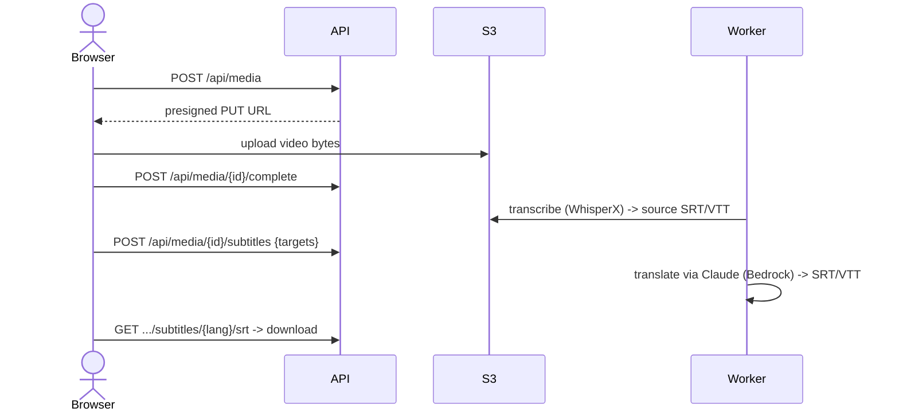

# 🎬 WhisperX Video Subtitling Platform

[](LICENSE) [](https://www.python.org/) [](https://github.com/m-bain/whisperX) [](https://aws.amazon.com/bedrock/) [](https://fastapi.tiangolo.com/) [](https://react.dev/)

> **Upload videos → get accurate, multi-language subtitles.**
> Transcribe speech with [WhisperX](https://github.com/m-bain/whisperX), translate it into any set of languages with [Claude on Amazon Bedrock](https://aws.amazon.com/bedrock/), and download timing-aligned **SRT / VTT** subtitle files — through a web UI or a REST API.

A full-stack platform that turns uploaded videos (or audio) into downloadable subtitles in many languages. Source language is **auto-detected per file**; you pick the target languages you want; every track shares the same timestamps so subtitles stay in sync regardless of language. Videos and subtitles are stored in **Amazon S3**; the whole thing deploys behind **CloudFront** with the origin locked down.

## ✨ What it does

| | Feature |
| --- | --- |
| 📤 | **Multi-video upload** — browser uploads stream straight to S3 via presigned URLs (no size bottleneck at the API). |
| 🌍 | **Multi-language subtitles** — select any number of target languages; each is translated by Claude and saved as its own track. |
| 🗣️ | **Auto language detection** — WhisperX detects each video's source language; no manual config. Target == source is skipped automatically. |
| ⏱️ | **Timing-aligned output** — translation reuses source segment timings, so SRT/VTT stay in sync across every language. |
| 📝 | **SRT + VTT export** — download soft-subtitle files, or preview them inline on an HTML5 `<video>` player. |
| 🎚️ | **Word-level timestamps + diarization** — WhisperX wav2vec2 alignment and optional pyannote speaker labels. |
| 🔁 | **Async pipeline** — a background worker transcribes then translates; the UI polls live status per language. |
| 🔒 | **Locked-down deployment** — CloudFront is the only entry; the origin rejects anything that doesn't come through it. |

## 🎯 Who it's for

- **Short-video creators / marketers** — subtitle a clip into many languages for cross-border distribution (抖音 / TikTok / YouTube / Reels).
- **Localization teams** — bulk-generate first-pass subtitle tracks for review instead of transcribing and translating by hand.
- **Media / education platforms** — add searchable, multi-language captions to a video library.
- **Developers** — a clean REST API (`/api/media`) and reference AWS deployment (S3 + Bedrock + CloudFront + EC2) to build on.

## 🏗️ Architecture at a glance


**The flow:** upload a video → WhisperX transcribes it and detects the language → you choose target languages → Claude (on Amazon Bedrock) translates each segment → SRT/VTT files land in S3, ready to download or preview. CloudFront is the only public entry; the EC2 origin only accepts traffic that comes through it.

End-to-end request sequence:


📐 **More diagrams** — pipeline, data model, state machines, component map, deployment topology: see **[docs/architecture.md](docs/architecture.md)**.

## Tech Stack

| Layer    | Technology                                                  |
| -------- | ----------------------------------------------------------- |
| Frontend | React 19, TypeScript, Vite, React Router, TanStack Query    |
| Backend  | Python, FastAPI, SQLAlchemy, Pydantic v2                    |
| AI/ML    | WhisperX (`large-v3`), faster-whisper, CTranslate2, wav2vec2, pyannote |
| Translation | Claude (Haiku/Sonnet/Opus) via Amazon Bedrock            |
| Storage  | Amazon S3 (videos + subtitles), SQLite (metadata)           |
| Infra    | CloudFront + EC2 + IAM; scripts in [`deploy/`](deploy/)      |
| Runtime  | CUDA 12.x + PyTorch (GPU) or CPU fallback (`int8`)          |

> **Two product surfaces in one repo:** the **video subtitling** product described here (`/api/media`, S3, Bedrock translation) is the primary surface. The original **batch audio transcription** engine (`/api/audio`, GPU benchmarks, diarization research) is documented in full below and remains available.

## Prerequisites

- Python 3.9+
- Node.js 18+
- NVIDIA GPU with CUDA 12.x drivers (recommended) or CPU-only mode
- FFmpeg (required by WhisperX for audio decoding)
- HuggingFace account with access token (required for speaker diarization)

```bash
# Verify GPU availability
nvidia-smi
python3 -c "import torch; print(torch.cuda.is_available())"
```

### Speaker Diarization Setup

WhisperX uses [pyannote.audio](https://github.com/pyannote/pyannote-audio) for speaker diarization. The pyannote models are **gated** — you must manually accept the license terms on HuggingFace before they can be downloaded.

**Step 1:** Create a HuggingFace access token at https://hf.co/settings/tokens

**Step 2:** Accept the user agreement on both model pages (click "Agree and access repository"):
- https://huggingface.co/pyannote/speaker-diarization-3.1
- https://huggingface.co/pyannote/segmentation-3.0

**Step 3:** Configure the token on your machine:

```bash
huggingface-cli login
# Paste your token when prompted
```

> ⚠️ Without completing these steps, speaker diarization will be silently skipped and transcription results will not include speaker labels.

### Alternative Diarization (No HuggingFace Agreement Needed)

If you cannot or prefer not to accept the pyannote gated model terms, the platform also supports a **speechbrain-based** diarization fallback that requires no additional agreements.

| Mode | Model | Clustering | Needs HF Agreement | Auto Speaker Count |
| ---- | ----- | ---------- | ------------------- | ------------------- |
| Mode A (default) | pyannote/speaker-diarization-3.1 | Built-in neural pipeline | ✅ Yes | ✅ Yes |
| Mode B | speechbrain/spkrec-ecapa-voxceleb | Spectral Clustering | ❌ No | ❌ Must specify `n_clusters` |
| Mode C | speechbrain/spkrec-ecapa-voxceleb | Agglomerative Clustering | ❌ No | ✅ Yes (via distance threshold) |

#### Accuracy Comparison

Tested on a synthetic two-speaker English audio (37s, generated by splitting the original single-speaker recording and pitch-shifting one half to simulate a second voice):

| Mode | Correct Segments | Accuracy | Latency | Notes |
| ---- | ---------------- | -------- | ------- | ----- |
| A — pyannote (WhisperX native) | 9 / 11 | **82%** | 2.19s | Best overall; end-to-end neural pipeline with VAD + embedding + clustering |
| B — ECAPA-TDNN + Spectral | 7 / 11 | 64% | 0.84s | Fast; requires knowing speaker count in advance |
| C — ECAPA-TDNN + Agglomerative | 5 / 11 | 45% | <0.01s | No dependencies; sensitive to threshold tuning |

#### When to use which

- **Mode A (pyannote)** — Best accuracy. Use this for production. Requires one-time HuggingFace agreement.
- **Mode B (Spectral)** — Good alternative when you know the number of speakers. No gated model restrictions.
- **Mode C (Agglomerative)** — Simplest setup, zero external dependencies beyond speechbrain. Best for quick prototyping.

#### Mode B/C Usage Example

```python
import torch
import numpy as np
import whisperx
from speechbrain.inference.speaker import EncoderClassifier
from sklearn.cluster import SpectralClustering

device = "cuda"
audio = whisperx.load_audio("meeting.mp3")

# Transcribe + align (same as default pipeline)
model = whisperx.load_model("large-v3", device, compute_type="float16")
result = model.transcribe(audio, batch_size=32)
align_model, meta = whisperx.load_align_model(language_code="en", device=device)
result = whisperx.align(result["segments"], align_model, meta, audio, device)

# Extract speaker embeddings per segment
classifier = EncoderClassifier.from_hparams(
    source="speechbrain/spkrec-ecapa-voxceleb",
    run_opts={"device": device}
)
embeddings = []
for seg in result["segments"]:
    chunk = audio[int(seg["start"]*16000):int(seg["end"]*16000)]
    wav = torch.tensor(chunk).unsqueeze(0).to(device)
    embeddings.append(classifier.encode_batch(wav).squeeze().cpu().numpy())

emb_matrix = np.stack(embeddings)
emb_matrix = emb_matrix / np.linalg.norm(emb_matrix, axis=1, keepdims=True)

# Cluster into N speakers
from scipy.spatial.distance import cdist
sim = np.clip(1 - cdist(emb_matrix, emb_matrix, metric="cosine"), 0, 1)
labels = SpectralClustering(n_clusters=2, affinity="precomputed").fit_predict(sim)

for seg, label in zip(result["segments"], labels):
    seg["speaker"] = f"SPEAKER_{label:02d}"
```

## Installation

### 1. Clone the repository

```bash
git clone https://github.com/Ziyang-Liao/WhisperX.git
cd WhisperX
```

### 2. Backend setup

> **Tested Dependency Versions** — The following versions are verified to work together:
>
> | Package | Version |
> | ------- | ------- |
> | PyTorch | 2.8.0+cu128 |
> | NumPy | 2.0.2 |
> | Transformers | 4.49.0 |
> | WhisperX | 3.7.5 |
> | CTranslate2 | 4.7.1 |
> | FastAPI | 0.128.0 |
> | SQLAlchemy | 2.0.46 |
> | Pydantic | 2.12.5 |

```bash
cd backend

# Create and activate virtual environment (recommended)
python3 -m venv venv
source venv/bin/activate

# Install dependencies
pip install -r requirements.txt

# Verify WhisperX GPU detection
python3 -c "from app.services.transcription_engine import DEFAULT_DEVICE; print('Device:', DEFAULT_DEVICE)"
# Expected output: Device: cuda
```

### 3. Frontend setup

```bash
cd frontend
npm install
```

## Usage

### Start the backend

```bash
cd backend
uvicorn app.main:app --host 0.0.0.0 --port 8000 --reload
```

The API server starts at `http://localhost:8000`. Interactive docs are available at `http://localhost:8000/docs`.

### Start the frontend

```bash
cd frontend
npm run dev
```

The web UI starts at `http://localhost:5173` and proxies API requests to the backend.

### Enable scheduled transcription (optional)

Set the `SCHEDULER_CRON` environment variable to enable automatic batch runs:

```bash
# Run batch transcription daily at 2:00 AM
SCHEDULER_CRON="0 2 * * *" uvicorn app.main:app --host 0.0.0.0 --port 8000
```

## API Reference

### Audio Management

| Method   | Endpoint                     | Description                          |
| -------- | ---------------------------- | ------------------------------------ |
| `POST`   | `/api/audio/upload`          | Upload one or more audio files       |
| `GET`    | `/api/audio`                 | List audio files (paginated, search) |
| `GET`    | `/api/audio/{id}`            | Get audio file details               |
| `PUT`    | `/api/audio/{id}`            | Replace an audio file                |
| `DELETE` | `/api/audio/{id}`            | Delete an audio file                 |
| `GET`    | `/api/audio/{id}/transcript` | Get transcription result             |

### Transcription Tasks

| Method | Endpoint                         | Description                    |
| ------ | -------------------------------- | ------------------------------ |
| `POST` | `/api/transcription/trigger`     | Trigger a batch transcription  |
| `GET`  | `/api/transcription/tasks`       | List tasks (paginated)         |
| `GET`  | `/api/transcription/tasks/{id}`  | Get task details               |

### Examples

**Upload audio files:**

```bash
curl -X POST http://localhost:8000/api/audio/upload \
  -F "files=@recording1.mp3" \
  -F "files=@recording2.wav"
```

**Trigger batch transcription:**

```bash
# Transcribe all pending files
curl -X POST http://localhost:8000/api/transcription/trigger

# Transcribe specific files
curl -X POST http://localhost:8000/api/transcription/trigger \
  -H "Content-Type: application/json" \
  -d '{"file_ids": [1, 2, 3]}'
```

**Get transcription result:**

```bash
curl http://localhost:8000/api/audio/1/transcript
```

Response:

```json
{
  "segments": [
    {
      "text": "Hello, welcome to the meeting.",
      "start": 0.0,
      "end": 2.34,
      "speaker": "SPEAKER_00",
      "words": [
        { "word": "Hello,", "start": 0.0, "end": 0.45, "score": 0.98, "speaker": "SPEAKER_00" },
        { "word": "welcome", "start": 0.52, "end": 0.91, "score": 0.97, "speaker": "SPEAKER_00" }
      ]
    }
  ],
  "language": "en",
  "duration": 125.6
}
```

## 🎬 Video Subtitling API (`/api/media`)

The video subtitling product is driven by the `/api/media` endpoints. Videos are
uploaded directly to S3 via presigned URLs; subtitles are generated
asynchronously and downloaded as SRT/VTT.

| Method   | Endpoint                                         | Description                                   |
| -------- | ------------------------------------------------ | --------------------------------------------- |
| `POST`   | `/api/media`                                     | Create a media record; returns a presigned upload URL |
| `POST`   | `/api/media/{id}/complete`                       | Confirm upload finished; enqueues transcription |
| `GET`    | `/api/media`                                      | List media with per-language subtitle status  |
| `GET`    | `/api/media/{id}`                                 | Media details + subtitle tracks               |
| `GET`    | `/api/media/{id}/stream`                          | Presigned URL to play the video               |
| `DELETE` | `/api/media/{id}`                                 | Delete the video + all subtitles              |
| `POST`   | `/api/media/{id}/subtitles`                       | Generate subtitles for selected target languages |
| `GET`    | `/api/media/{id}/subtitles`                       | List subtitle tracks + statuses               |
| `GET`    | `/api/media/{id}/subtitles/{lang}/{srt\|vtt}`     | Presigned URL to download a subtitle file     |

**End-to-end flow:**



```bash
# 1. create + get a presigned upload URL
curl -s -X POST $BASE/api/media -H 'content-type: application/json' \
  -d '{"filename":"clip.mp4","content_type":"video/mp4"}'
# 2. upload the bytes to the returned upload_url (PUT), then:
curl -X POST $BASE/api/media/1/complete
# 3. once transcription completes, request target languages
curl -X POST $BASE/api/media/1/subtitles -H 'content-type: application/json' \
  -d '{"target_languages":["ja","zh","es"]}'
# 4. download a subtitle file (returns a presigned URL)
curl $BASE/api/media/1/subtitles/ja/srt
```

> ☁️ **Deploy it on AWS** — one-command scripts for S3 + IAM + EC2 + CloudFront are in
> **[`deploy/`](deploy/)** (see [deploy/README.md](deploy/README.md)). Translation runs on
> Amazon Bedrock, so no GPU is required for the translation step.

## Supported Formats

**Video:** `mp4` · `mov` · `mkv` · `webm` · `avi` · `m4v`
**Audio:** `wav` · `mp3` · `flac` · `m4a` · `ogg`

## Language Support

WhisperX `large-v3` supports **99 languages** with automatic detection. The engine analyzes the first 30 seconds of audio to identify the language — no manual configuration needed.

Top supported languages and their typical accuracy:

| Language | Code | Auto-Detection | Notes |
| -------- | ---- | -------------- | ----- |
| English | `en` | ✅ Excellent | Best accuracy overall |
| Chinese (Mandarin) | `zh` | ✅ Excellent | Simplified & Traditional |
| Japanese | `ja` | ✅ Excellent | |
| Korean | `ko` | ✅ Excellent | |
| German | `de` | ✅ Excellent | |
| French | `fr` | ✅ Excellent | |
| Spanish | `es` | ✅ Excellent | |
| Russian | `ru` | ✅ Good | |
| Arabic | `ar` | ✅ Good | |
| Hindi | `hi` | ✅ Good | |
| Portuguese | `pt` | ✅ Good | |
| Italian | `it` | ✅ Good | |
| ... | ... | ... | 99 languages total |

If you know the language in advance, you can skip auto-detection (saves ~1s) by specifying it in the `TranscriptionEngine`:

```python
# Auto-detect (default)
result = engine.transcribe("audio.mp3")

# Manual override — skips detection, slightly faster
model.transcribe(audio, batch_size=32, language="zh")
```

## GPU Configuration

The engine auto-detects the best device at startup:

| Environment       | Device | Compute Type | Batch Size |
| ----------------- | ------ | ------------ | ---------- |
| NVIDIA GPU (CUDA) | `cuda` | `float16`    | 32         |
| CPU only          | `cpu`  | `int8`       | 4          |

The WhisperX `large-v3` model requires approximately 6 GB of VRAM in FP16 mode. A GPU with at least 8 GB VRAM is recommended; 24 GB (e.g., A10G, RTX 4090) enables larger batch sizes for higher throughput.

## Project Structure

```
WhisperX/
├── backend/
│   ├── app/
│   │   ├── main.py                  # FastAPI application entry point
│   │   ├── models/                  # SQLAlchemy ORM models
│   │   │   ├── database.py          # Database engine & session
│   │   │   ├── audio_file.py        # AudioFile model
│   │   │   ├── transcription_task.py# TranscriptionTask model
│   │   │   └── task_file_record.py  # Task-File association model
│   │   ├── schemas/                 # Pydantic request/response schemas
│   │   ├── routers/                 # API route handlers
│   │   │   ├── audio.py             # /api/audio endpoints
│   │   │   └── transcription.py     # /api/transcription endpoints
│   │   └── services/                # Business logic
│   │       ├── transcription_engine.py  # WhisperX wrapper
│   │       ├── batch_processor.py       # Batch task execution
│   │       ├── audio_manager.py         # File CRUD operations
│   │       └── scheduler.py            # Cron-based scheduling
│   ├── tests/                       # Backend test suite
│   ├── data/                        # SQLite DB & uploaded files
│   └── requirements.txt
├── frontend/
│   ├── src/
│   │   ├── App.tsx                  # Root component & routing
│   │   ├── pages/                   # Page components
│   │   ├── api/                     # API client functions
│   │   └── components/              # Shared UI components
│   ├── package.json
│   └── vite.config.ts
└── README.md
```

## Testing

### Backend

```bash
cd backend
pytest -v
```

### Frontend

```bash
cd frontend
npm test
```

## Demo: End-to-End Test

The following is a real test run on an AWS EC2 instance with an NVIDIA A10G GPU (24 GB VRAM), demonstrating the full pipeline from audio upload to transcription with speaker diarization.

### Environment

| Item | Value |
| ---- | ----- |
| Instance | AWS EC2 (NVIDIA A10G, 24 GB VRAM) |
| CUDA | 12.8 |
| PyTorch | 2.8.0+cu128 |
| WhisperX | 3.7.5 (large-v3, FP16) |
| Diarization | pyannote/speaker-diarization-3.1 |
| Python | 3.9 |

### Step 1 — Start the backend

```bash
cd backend
uvicorn app.main:app --host 0.0.0.0 --port 8000
```

```
INFO:     Uvicorn running on http://0.0.0.0:8000
```

### Step 2 — Upload audio file

Test audio: a 41.7-second English phone call recording from [Pixabay](https://pixabay.com/).

```bash
curl -X POST http://localhost:8000/api/audio/upload \
  -F "files=@test_audio.mp3"
```

```json
[
    {
        "id": 1,
        "filename": "test_audio.mp3",
        "file_size": 833280,
        "duration": 41.664,
        "format": "mp3",
        "upload_time": "2026-02-25T02:27:24.936461",
        "transcription_status": "pending"
    }
]
```

### Step 3 — Trigger batch transcription

```bash
curl -X POST http://localhost:8000/api/transcription/trigger \
  -H "Content-Type: application/json" \
  -d '{"file_ids": [1]}'
```

```json
{
    "id": 1,
    "trigger_type": "manual",
    "status": "completed",
    "total_files": 1,
    "processed_files": 1,
    "success_count": 1,
    "failure_count": 0,
    "started_at": "2026-02-25T02:28:06.038811",
    "completed_at": "2026-02-25T02:28:18.802035",
    "duration_seconds": 12.76
}
```

41.7 seconds of audio transcribed in 12.76 seconds (3.3x real-time) on a single A10G GPU.

### Step 4 — Get transcription result

```bash
curl http://localhost:8000/api/audio/1/transcript
```

```
Language: en | Duration: 41.7s | Segments: 14

[ 0.03s -  0.69s]  Hello.
[ 0.89s -  4.46s]  Refund the headphones, okay?
[ 4.48s -  5.24s]  Listen here, buddy.
[ 5.52s -  8.08s]  My sister wants her stupid headphones fixed.
[ 8.72s - 11.90s]  So you will refund them and send her a new pair.
[13.43s - 15.29s]  Can you put the manager on, please?
[16.35s - 16.97s]  Is this the manager?
[17.89s - 21.28s]  Give my sister a refund on her headphones.
[21.30s - 24.62s]  I have a guarantee it says you must give me a refund.
[25.14s - 27.74s]  Without it, you're breaking the law of false advertising.
[28.09s - 31.40s]  If you want me to continue to prosecute you, I shall do so.
[32.11s - 36.08s]  Now, without further ado, will you please refund my sister's headphones?
[37.28s - 38.69s]  No, no, no!
[39.35s - 41.50s]  Refund the headphones now!
```

### Step 5 — Word-level timestamps

Each word includes a precise timestamp and confidence score:

```
 0.03s -  0.69s  [0.95]  Hello.
 0.89s -  1.29s  [0.79]  Refund
 1.31s -  1.37s  [0.88]  the
 1.45s -  2.09s  [0.89]  headphones,
 4.48s -  4.74s  [0.90]  Listen
 4.78s -  4.96s  [0.70]  here,
 4.98s -  5.24s  [0.88]  buddy.
 ...
40.11s - 40.69s  [0.77]  headphones
40.97s - 41.50s  [0.73]  now!
```

### Step 6 — Speaker diarization

Using pyannote speaker-diarization-3.1:

```python
engine = TranscriptionEngine()
result = engine.transcribe("test_audio.mp3", enable_diarization=True)
```

**Single-speaker result** (this test audio is a one-sided phone call — only the caller was recorded):

```
Language: en | Duration: 41.7s | Segments: 14
Speakers: 1 — SPEAKER_00

[ 0.0s -  0.7s]  SPEAKER_00:  Hello.
[ 0.9s -  4.5s]  SPEAKER_00:  Refund the headphones, okay?
[ 4.5s -  5.2s]  SPEAKER_00:  Listen here, buddy.
[ 5.5s -  8.1s]  SPEAKER_00:  My sister wants her stupid headphones fixed.
[ 8.7s - 11.9s]  SPEAKER_00:  So you will refund them and send her a new pair.
[13.4s - 15.3s]  SPEAKER_00:  Can you put the manager on, please?
[16.4s - 17.0s]  SPEAKER_00:  Is this the manager?
[17.9s - 21.3s]  SPEAKER_00:  Give my sister a refund on her headphones.
[21.3s - 24.6s]  SPEAKER_00:  I have a guarantee it says you must give me a refund.
[25.1s - 27.7s]  SPEAKER_00:  Without it, you're breaking the law of false advertising.
[28.1s - 31.4s]  SPEAKER_00:  If you want me to continue to prosecute you, I shall do so.
[32.1s - 36.1s]  SPEAKER_00:  Now, without further ado, will you please refund my sister's headphones?
[37.3s - 38.7s]  SPEAKER_00:  No, no, no!
[39.3s - 41.5s]  SPEAKER_00:  Refund the headphones now!
```

pyannote correctly identified only 1 speaker — the caller. The customer service agent's voice was not captured in this one-sided recording.

**Multi-speaker result** (tested with a synthetic two-speaker audio — generated by splitting the original recording and pitch-shifting one half to simulate a second voice, 37s):

```
Language: en | Duration: 36.2s | Segments: 9
Speakers: 2 — SPEAKER_00, SPEAKER_01

[  0.0s -   2.0s]  SPEAKER_01:  hello refund the headphones okay
[  4.7s -   5.5s]  SPEAKER_00:  listen here folks
[  9.7s -  11.3s]  SPEAKER_01:  i have a guarantee so you will
[ 11.6s -  13.4s]  SPEAKER_00:  refund them and send her a new pair
[ 15.6s -  17.1s]  SPEAKER_01:  can you put the manager on please
[ 19.1s -  20.5s]  SPEAKER_00:  you must give me a refund
[ 23.1s -  26.5s]  SPEAKER_01:  without it you're breaking the law is this the manager
[ 27.1s -  29.3s]  SPEAKER_00:  give my sister a refund on her headphones
[ 35.5s -  36.2s]  SPEAKER_01:  Yeah.
```

With multi-speaker audio, pyannote correctly assigns distinct labels (SPEAKER_00, SPEAKER_01) to each participant.

### Diarization Re-Segmentation: Why and How

WhisperX's default `assign_word_speakers` assigns speaker labels to existing ASR segments via majority vote. When the ASR produces coarse segments (e.g., 29 seconds of continuous speech as a single segment), speaker switches within that segment are lost — the entire segment gets labeled as one speaker.

We solved this by **re-segmenting based on diarization boundaries** instead of relying on ASR segmentation:

1. ASR transcription + wav2vec2 alignment produce word-level timestamps (unchanged)
2. pyannote diarization independently identifies speaker time regions
3. Each word is assigned a speaker based on maximum time overlap with diarization output
4. Consecutive same-speaker words are grouped into new segments — a new segment starts whenever the speaker changes

This approach requires no VAD parameter tuning and adapts automatically to any speaking pace or pause pattern.

#### Before vs After Comparison

Tested on the same two-speaker audio (36.2s):

**Before (WhisperX default `assign_word_speakers`):**

```
Speakers: 1 — SPEAKER_01    ← only 1 speaker detected at segment level
Segments: 2

[  0.0s -  29.3s]  SPEAKER_01:  hello refund the headphones okay listen here folks
                    i have a guarantee so you will refund them and send her a new
                    pair can you put the manager on please ...
[ 35.5s -  36.2s]  SPEAKER_01:  Yeah.
```

**After (diarization-boundary re-segmentation):**

```
Speakers: 2 — SPEAKER_00, SPEAKER_01    ← both speakers correctly identified
Segments: 9

[  0.0s -   2.0s]  SPEAKER_01:  hello refund the headphones okay
[  4.7s -   5.5s]  SPEAKER_00:  listen here folks
[  9.7s -  11.3s]  SPEAKER_01:  i have a guarantee so you will
[ 11.6s -  13.4s]  SPEAKER_00:  refund them and send her a new pair
[ 15.6s -  17.1s]  SPEAKER_01:  can you put the manager on please
[ 19.1s -  20.5s]  SPEAKER_00:  you must give me a refund
[ 23.1s -  26.5s]  SPEAKER_01:  without it you're breaking the law is this the manager
[ 27.1s -  29.3s]  SPEAKER_00:  give my sister a refund on her headphones
[ 35.5s -  36.2s]  SPEAKER_01:  Yeah.
```

| Metric | Before (default) | After (re-segmentation) |
| ------ | ----------------- | ----------------------- |
| Speakers detected | 1 ❌ | 2 ✅ |
| Segments | 2 | 9 |
| Speaker switches preserved | No | Yes |
| Text content | Identical | Identical |
| Word-level timestamps | Identical | Identical |
| VAD parameter tuning needed | N/A | No |

### Performance Summary

| Metric | Value |
| ------ | ----- |
| Audio duration | 41.7s |
| Transcription time | 12.76s |
| Real-time factor | 3.3x faster than real-time |
| Model | WhisperX large-v3 (FP16) |
| GPU | NVIDIA A10G (24 GB) |
| Batch size | 32 |
| Word count | 90 words with timestamps |
| Segments | 14 |
| Language detected | English (confidence: 1.00) |

### GPU Benchmark: g4dn vs g5 vs g6

All benchmarks use WhisperX `large-v3` with FP16, batch size 32, warm start (model pre-loaded in VRAM). Inference time excludes model loading.

**Test environment:**

| Instance | GPU | VRAM | vCPU | On-Demand Price (us-east-1) |
| -------- | --- | ---- | ---- | --------------------------- |
| g4dn.xlarge | NVIDIA T4 | 16 GB | 4 | ~$0.526/hr |
| g5.2xlarge | NVIDIA A10G | 24 GB | 8 | ~$1.212/hr |
| g6.xlarge | NVIDIA L4 | 24 GB | 4 | ~$0.805/hr |

**36-second audio (transcription + alignment, avg of 3 runs):**

| Instance | GPU | Inference Time | Real-Time Factor |
| -------- | --- | -------------- | ---------------- |
| g4dn.xlarge | T4 (16 GB) | 4.28s | 8.5x |
| g6.xlarge | L4 (24 GB) | 3.04s | 11.9x |
| g5.2xlarge | A10G (24 GB) | 2.63s | **13.7x** |

**5.4-minute audio (transcription + alignment):**

| Instance | GPU | Inference Time | Real-Time Factor |
| -------- | --- | -------------- | ---------------- |
| g4dn.xlarge | T4 (16 GB) | 15.51s | 21.0x |
| g5.2xlarge | A10G (24 GB) | 9.53s | 34.1x |
| g6.xlarge | L4 (24 GB) | 9.44s | **34.5x** |

**Key findings:**

- **G6 (L4) offers the best price-performance** — matches A10G throughput on longer audio at ~66% of the cost.
- **G5 (A10G) leads on short audio** — higher memory bandwidth helps with small batch workloads.
- **G4dn (T4) is ~1.6x slower** but remains viable for cost-sensitive or low-throughput use cases.
- All three GPUs scale well: RTF improves significantly with longer audio due to better batch utilization.
- CPU inference (int8, tested on g5.2xlarge) took ~44s for 36s audio (0.8x real-time) — roughly **17x slower** than GPU.

## Changelog

See [CHANGELOG.md](CHANGELOG.md) for a detailed release history.

## License

Apache 2.0 - See [LICENSE](LICENSE) for details.

## Citation

```bibtex
@software{whisperx_batch_platform,
  title  = {WhisperX Batch Speech-to-Text Platform},
  author = {Ziyang Liao},
  year   = {2026},
  url    = {https://github.com/Ziyang-Liao/WhisperX}
}
```
