# Architecture

Diagrams for the video subtitling platform. The AWS architecture and sequence
diagrams are rendered images (real AWS service icons / UML); the supporting
diagrams are Mermaid and render natively on GitHub. For the narrative design and
rollout, see [subtitle-platform-design.md](subtitle-platform-design.md) and
[phase1-handoff.md](phase1-handoff.md).

> Diagram sources are reproducible: AWS-icon PNGs are generated by
> [`diagrams/architecture_aws.py`](diagrams/architecture_aws.py) (mingrammer
> `diagrams` + Graphviz); the sequence PNG is rendered from the Mermaid block
> below via `mermaid-cli`.

---

## 1. AWS architecture (real service icons)

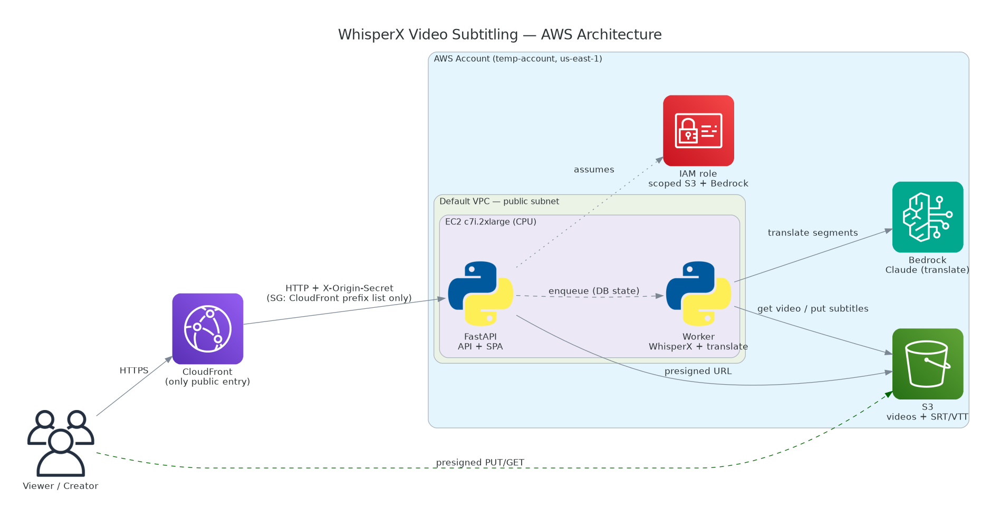

## 1b. System overview (logical)

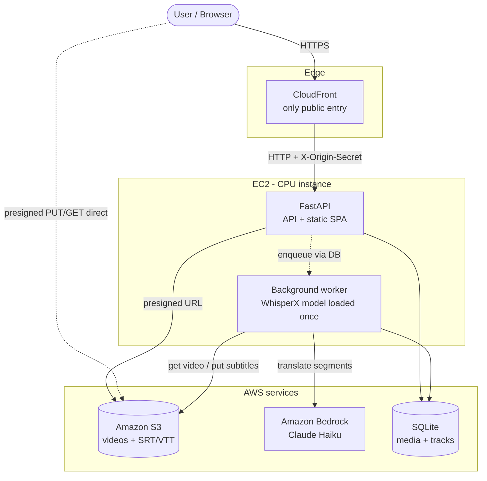

The security group only admits CloudFront's managed prefix list, and the app
rejects any request lacking the `X-Origin-Secret` header CloudFront injects — so
the instance cannot be reached except through CloudFront.

---

## 2. Upload to subtitle - end-to-end sequence

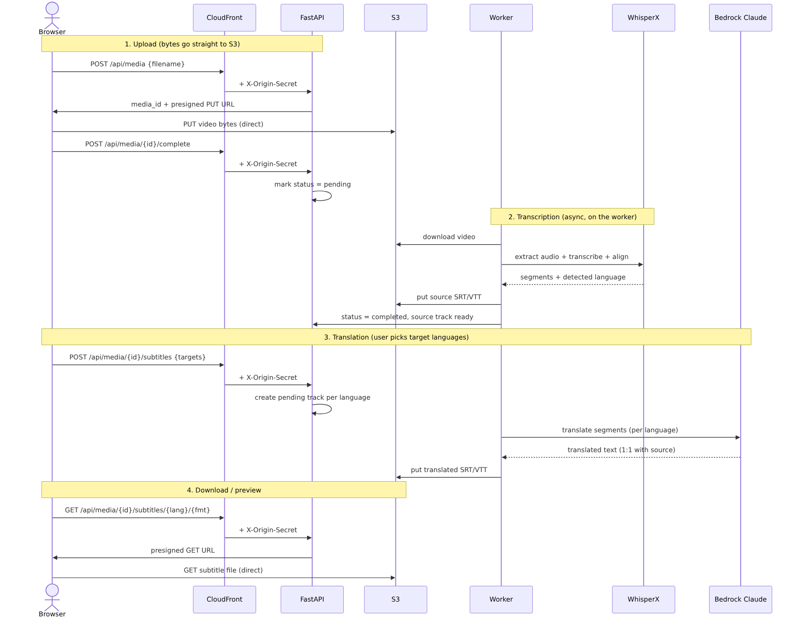

Mermaid source for the sequence diagram

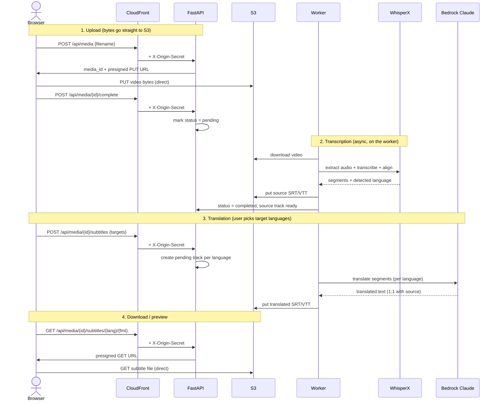

---

## 3. Processing pipeline

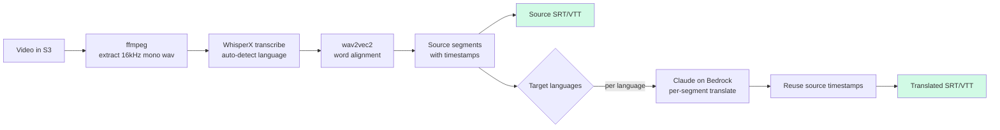

Translation reuses each source segment's start/end and only replaces the text,
so subtitle timing stays aligned across every language.

---

## 4. Data model

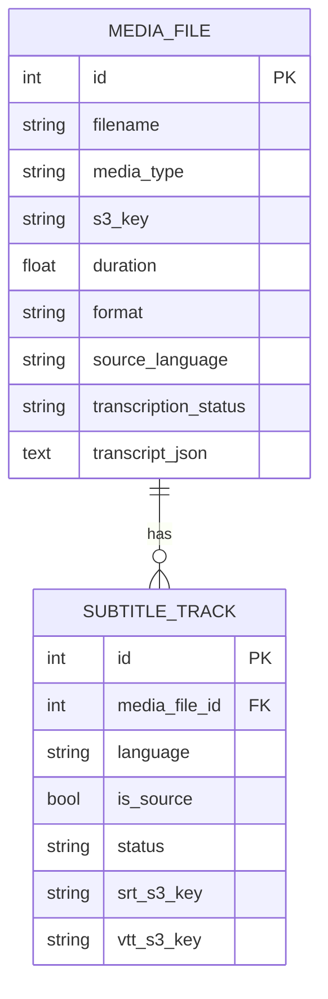

One media file owns N subtitle tracks: one source-language track produced by
transcription, plus one track per requested target language. The pair
`(media_file_id, language)` is unique.

---

## 5. Status state machines

A media file's transcription status:

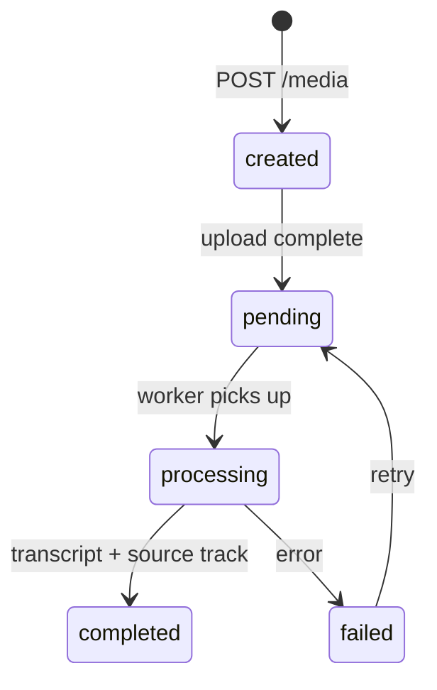

A subtitle track's status (the translation queue):

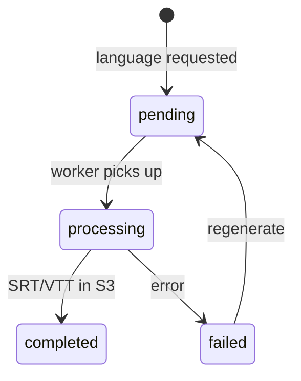

---

## 6. Backend components

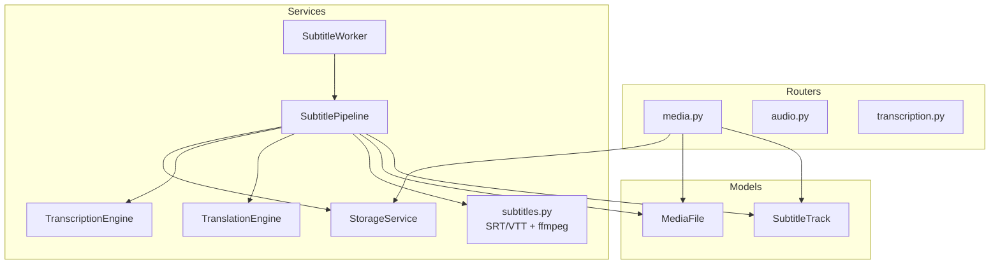

---

## 7. Deployment topology (temp-account)

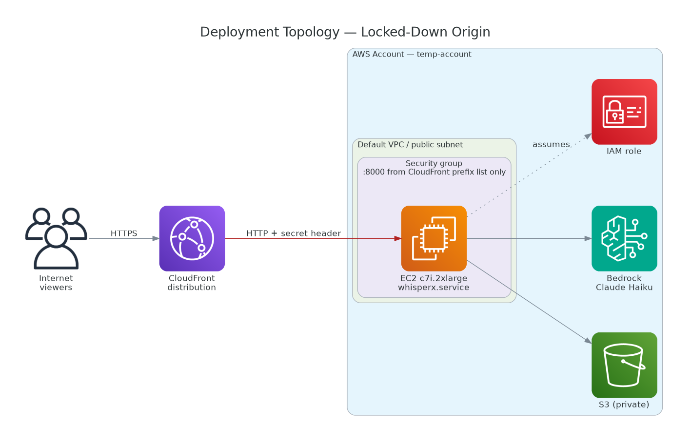

Mermaid source for the deployment topology

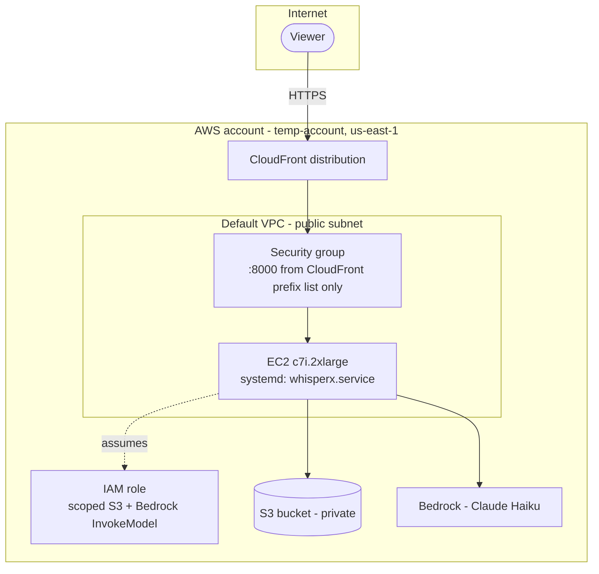

> No custom domain in this environment, so CloudFront-to-origin is HTTP while
> viewer-to-CloudFront is HTTPS. End-to-end TLS needs a domain + ACM (+ ALB) —
> see the design doc's Phase 4.
